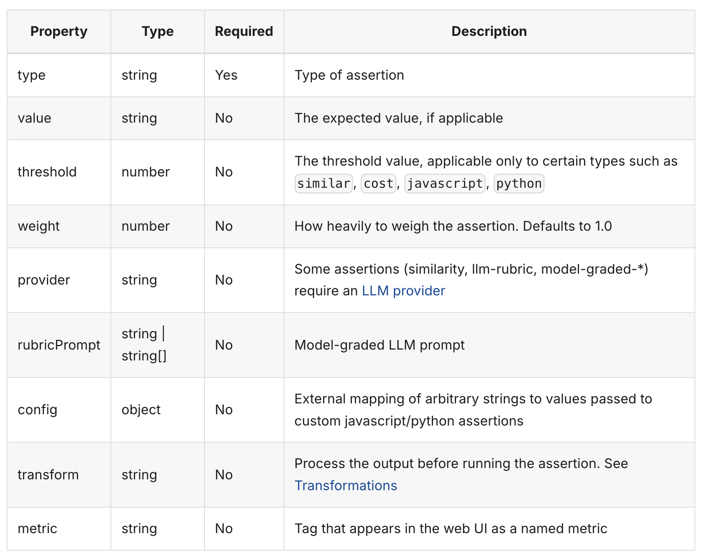

# 🚀 Evaluations for LLMs: A Promptfoo Tutorial

This tutorial covers evaluating and optimizing AI models for LLM applications using [**Promptfoo**](https://www.promptfoo.dev/). As a hypothetical startup building cutting-edge educational tools, ensuring the quality, efficiency, and reliability of our AI features is paramount. Promptfoo helps us achieve just that by providing a robust, open-source testing framework for LLMs.

## 💡 Why Evaluate AI Models?

In any application leveraging LLMs, thorough evaluation is non-negotiable. Whether you're building chatbots, content generators, data analyzers, or, like us, language learning platforms, here's why evaluating your AI models is critical:

  - **Quality Assurance:** Ensures the AI consistently delivers accurate, relevant, and helpful outputs. Without evaluation, models can drift, provide inconsistent results, or fail in unexpected scenarios.
  - **Performance Optimization:** Identifies bottlenecks in speed (latency) and resource consumption (cost), allowing you to deliver a snappy user experience while managing operational expenses.
  - **Risk Mitigation:** Helps uncover and prevent issues like biased outputs, harmful content generation, data leakage, and prompt injection vulnerabilities, protecting your users and your brand.
  - **Model & Prompt Comparison:** Provides a systematic way to compare different LLM providers (e.g., OpenAI, Google, Anthropic), various models from the same provider (e.g., Gemini 1.5 Flash vs. Gemini 1.5 Pro), and different prompt engineering strategies. This enables data-driven decisions on which AI components to use.
  - **Rapid Iteration & Development:** Automates the testing cycle for LLM interactions, replacing slow, manual testing. This allows developers to iterate on prompts and models quickly, accelerating the development process.
  - **Reproducibility & Explainability:** Creates a clear, testable history of how your LLMs perform under various conditions, aiding in debugging and understanding model behavior.

## 🌍 Our Language Learning Demo App

This tutorial is based on a sample language learning application that uses AI for teaching languages:

### 📝 Text-Based Practice

  - **Grades** student answers using OpenAI's GPT-4o-mini, providing an objective score.
  - **Provides constructive feedback** using Google's Gemini 1.5 Flash.
  - **Identifies mistakes** in grammar and vocabulary.
  - **Tracks progress** with a transparent 1-10 scoring system.

### 🖼️ Image-Based Learning

  - **Analyzes** uploaded images with Google's Gemini 1.5 Flash (Vision capabilities).
  - **Evaluates** student descriptions of images in the target language.
  - **Suggests relevant vocabulary** based on the visual context.
  - **Provides contextual feedback** relating to both the image and the student's description.

You can preview the [sample app here](https://www.google.com/search?q=https://multilingo-app-production.up.railway.app/), in case you have issues running the application locally.

## Detailed Explanation of the Flow of the App:
User Interaction: The process begins with the User submitting either a text answer to a question or an image and its description within the Language Learning App (Frontend).

### Frontend to Backend:

For text answers, the Frontend sends an HTTP POST request to the `/api/chat` endpoint on the Backend API, including the language and the answer.
For image answers, the Frontend sends an HTTP POST request to the `/api/analyze-image` endpoint, including the language, the description, and the imageBase64 data.

### Backend Processing (Text Answer Flow):

1. Grading: The Backend first calls the gradeAnswer function, which leverages GPT-4o-mini. This LLM processes the user's answer and returns a mark (1-10) and a list of mistakes in JSON format.
2. Feedback Generation: Next, the Backend calls the generateFeedback function, powered by Gemini 1.5 Flash. It uses the mark and mistakes from the previous step to craft a feedback_message string.
3. Feedback Moderation (Guardrails): Immediately after generating feedback, the Backend calls the moderateFeedback function, which again uses GPT-4o-mini. This LLM acts as a guardrail, checking the generated feedback_message for any inappropriate content and returning a boolean status (isClean). If the feedback is flagged, it won't be sent to the user.

### Backend Processing (Image Answer Flow):

Image Analysis & Evaluation: 

The Backend directly calls the analyzeImageForLanguageLearning function. This single function utilizes Gemini 1.5 Flash Vision capabilities to perform a comprehensive analysis. It takes the image and description, and in a single LLM interaction, returns a JSON object containing the imageAnalysis, a mark, feedback on the description, and vocabulary suggestions related to the image.

### Backend to Frontend & User Display:

For text answers, if the feedback is clean, the Backend consolidates the mark and feedback_message and sends them back to the Frontend.
For image answers, the Backend sends the complete imageAnalysisResult (containing analysis, mark, feedback, and vocabulary) to the Frontend.
Finally, the Frontend displays the processed grades, feedback, and analysis directly to the User.


## 🚀 Getting Started with Promptfoo

### Prerequisites

  - [Node.js](https://nodejs.org/en/download/) 18+ installed
  - An OpenAI API key
  - A Google Gemini API key

### Installation

1.  **Clone the project and install dependencies:**

    ```bash
    cd multilingo-language-app
    npm install
    ```

2.  **Install Promptfoo globally (recommended for command-line access):**

    ```bash
    npm install -g promptfoo
    ```

3.  **Set up environment variables:**
    Create a `.env` file in the `guided-project-from-scratch` folder to securely store your API keys:

    ```bash
    OPENAI_API_KEY=your_openai_key_here
    GOOGLE_API_KEY=your_gemini_key_here
    ```

    *Ensure these keys are valid and have access to the respective models (e.g., `gpt-4o-mini`, `gemini-pro`).*

4. **Check that Promptfoo works**

  In the terminal run:
  ```bash
  promptfoo init
  ```

5.  **Run the demo app (optional, to see it in action):**

    ```bash
    npm run start
    ```

    The application will typically be accessible at `http://localhost:3000`.

-----

## 📝 Promptfoo Configuration: The `promptfooconfig.yaml` File

Promptfoo evaluations are defined in a YAML file, typically named `promptfooconfig.yaml`. This file acts as your blueprint, specifying which **LLM providers** to test, the **prompts** to use, and the **test cases** and **assertions** that validate the LLM's output.

### 1\. Providers: Which LLMs to Test?

The `providers` section specifies the LLM APIs you want to evaluate. You can include multiple providers to compare their performance for a given task. Each provider is identified by a unique `id`.

```yaml
providers:
  - id: google:gemini-1.5-flash # Our current feedback model
  - id: google:gemini-1.5-pro   # A more powerful, but more expensive alternative
  - id: openai:gpt-4o-mini      # Our grading model
```

*Promptfoo supports a wide range of providers, including OpenAI, Google, Anthropic, Azure OpenAI, Replicate, Hugging Face, and even local or custom API integrations.*

### 2\. Prompts: What Instructions to Give the LLM?

The `prompts` section contains the actual instructions (or prompt templates) that you send to the LLMs. They can include placeholders (`{{variable}}`) that are dynamically filled by your test cases, allowing you to test how different prompt wordings affect the LLM's output.

```yaml
prompts:
  # Prompt for generating student feedback
  - id: feedback-prompt
    prompt: |
      ## System
      You are a friendly language tutor.
      ## User
      Based on the following grading in {{language}}, provide constructive feedback to the student in English so they can improve in learning the language.
      If the mark is 10, just say the user did a great work. Do not use markdown for the feedback message.
      The feedback should be concise and direct.
      
      Grading:
      {
        'mark': {{mark}},
        'mistakes': {{mistakes}}
      }
      
      Return JSON with a single key 'feedback_message' containing the message.
      Feedback:

  # Prompt for grading student answers
  - id: grading-prompt
    prompt: |
      Grade the following answer in {{language}} on a scale of 1 to 10.
      Provide the grade as an integer under the key "mark" and list the mistakes under the key "mistakes".
      
      Answer:
      "{{answer}}"
      
      Response format (JSON):
      {
        "mark": integer,
        "mistakes": ["mistake1", "mistake2", ...]
      }
```

*Here, we define two distinct prompts, each with an `id` for easier reference in tests.*

### 3\. Tests & Assertions: How to Validate LLM Output?

The `tests` section is where you define individual test cases. Each `test` specifies the input variables (`vars`) for your prompt and the expected outcomes (`assert`) for the LLM's response. Assertions are the core of automated evaluation, allowing you to automatically check the quality of the outputs.

-----

### **Assertions & Metrics: Your Evaluation Toolkit**

Assertions are used to compare the LLM output against expected values or conditions. While assertions are not required to run an eval, they are a useful way to automate your analysis and quantify "Accuracy," which in Promptfoo, is defined as the proportion of prompts that produce the expected or desired output.

To use assertions in your test cases, add an `assert` property to the test case with an array of assertion objects. Each assertion object should have a `type` property indicating the assertion type and any additional properties required for that assertion type.

**Common Assertion Properties:**



You can also **negate** some tests type by prepending `not-` (e.g., `not-equals`, `not-regex`).

For more details on assertions, see [Promptfoo assertions documentation](https://www.promptfoo.dev/docs/configuration/expected-outputs/)

**Grouping Assertions via Assertion Sets (`assert-set`):**
Assertions can be grouped together using an `assert-set` type. All assertions within an `assert-set` must pass for the set to pass by default. You can also define a `threshold` for an `assert-set` (e.g., `threshold: 0.5` means 50% of assertions within the set must pass).

```yaml
# Example of an assert-set
tests:
  - description: 'Test that the output is cheap and fast'
    vars:
      example: 'Hello, World!'
    assert:
      - type: assert-set
        assert:
          - type: cost
            threshold: 0.001
          - type: latency
            threshold: 200
```

**Deterministic Evaluation Metrics:**
These are programmatic tests run directly on the LLM output. They're fast and reliable for objective checks.

  - `equals`: Output matches exactly.
  - `contains`: Output contains a substring.
  - `is-json`: Output is valid JSON (can include schema validation).
  - `cost`: Cost is below a threshold.
  - `latency`: Latency is below a threshold (milliseconds).
  - `javascript` / `python`: Provided custom function validates the output.
  - `regex`, `starts-with`, `contains-any`, `contains-all`, and their case-insensitive counterparts.
  - `is-valid-function-call`, `guardrails`, etc. (many more available).

**Model-Assisted Evaluation Metrics:**
These metrics rely on LLMs or other machine learning models to grade the output, ideal for subjective qualities.

  - `llm-rubric`: An LLM grades output based on a given qualitative rubric.
  - `model-graded-closedqa`: An LLM evaluates if the output adheres to specific criteria (often yes/no).
  - `answer-relevance`: Checks if LLM output is related to the original query.
  - `select-best`: Compares multiple outputs for a test case and picks the best.
  - `similar`, `classifier`, `g-eval`, `context-faithfulness`, `context-recall`, `context-relevance`, `factuality`, `pi`.

  For more in detail overview of Model-Assisted Evaluation Metrics see [Promptfoo documenation](https://www.promptfoo.dev/docs/configuration/expected-outputs/model-graded/)

**Weighted Assertions & Scoring Requirements:**
You can assign different `weight` to assertions to reflect their importance. The final test score is a weighted average of assertion scores. A `threshold` property can also be set at the test case level, meaning the test only passes if the combined weighted score of its assertions exceeds this threshold.

-----

## 📈 Scenario 1: Optimizing for Cost Efficiency and Feedback Quality

As a startup, managing API costs without sacrificing quality is crucial. Our language learning app currently uses **Google Gemini 1.5 Flash** for generating student feedback. While fast, we need to assess if a potentially more expensive but powerful model like **Gemini 1.5 Pro** provides *significantly* better feedback quality to justify its cost, or if Flash is good enough. We also need to ensure the feedback always maintains a consistent JSON structure.

Let's set up the providers in `promptfooconfig.json-latency.yaml` for this.

```yaml
# promptfooconfig.yaml
description: "Comparing Gemini 2.0 Flash and Flash Lite"

providers:
  - id: google:gemini-2.0-flash # Our current feedback model 
  - id: google:gemini-2.0-flash-lite
```

### Running and Analyzing Scenario 1

1.  **Save your `promptfooconfig.yaml`**. Make sure it contains all the sections outlined above.
2.  **Run the evaluation**:
    ```bash
    promptfoo eval
    ```
    Promptfoo will send each prompt/test case combination to both `google:gemini-2.0-flash` and `google:gemini-2.0-flash-lite`.
3.  **View the results** in your browser:
    ```bash
    promptfoo view
    ```
    Navigate to `http://localhost:15500`. In the web UI, you can:
      * See side-by-side comparisons and outputs for each test case.
      * Observe which assertions passed or failed for each model.
      * Compare the assertions for two models for the same outputs, alongside their qualitative feedback assessed by `llm-rubric`.

**Conclusion for Scenario 1:** By analyzing these results, we can make a data-driven decision. Depending on the assertions we can choose the best model for our use case.

-----

## 🎯 Scenario 2: Fine-tuning Grading Consistency with Hyperparameters

Our app uses **GPT-4o-mini** for grading student answers. While generally accurate, we need to ensure its consistency, especially for edge cases. We suspect the `temperature` hyperparameter, which controls the randomness of the output, might be influencing variability. A lower `temperature` usually leads to more deterministic outputs, which is ideal for precise grading.

This scenario will demonstrate how to test different **hyperparameter** settings for a model and how to use robust assertions for grading accuracy and output format.

### Step 1: Configure Providers with Varying Hyperparameters

We'll define `openai:gpt-4o-mini` twice, each with a different `temperature` setting. This allows Promptfoo to run the same tests against the same model but with different internal behaviors. 

Have a look at the test file in `promptfooconfig.hyperparameters.yaml`

### Running and Analyzing Scenario 2

1.  **Run the evaluation**:
    ```bash
    promptfoo eval -c promptfooconfig.hyperparameters.yaml
    ```
2.  **View the results**:
    ```bash
    promptfoo view
    ```
    In the UI, you'll see a comparison between "GPT-4o-mini (T=0.2)" and "GPT-4o-mini (T=0.7)". Focus on the `Mark Accuracy`, `Mistakes Identification`, and `Security/Robustness` metrics.
      * Observe if the **lower `temperature`** model (`T=0.2`) consistently provides more accurate and predictable grades, especially for edge cases and the prompt injection attempt.
      * Look for deviations in the `T=0.7` model, which might show more variance or succumb to the injection attempt.

**Conclusion for Scenario 2:** This evaluation will help us test the different model hyperparameters for our use cases. We also verify the crucial `is-json` output format for reliable application integration.

-----

## 🔄 Continuous Testing with CI/CD

To ensure that our AI quality remains high as we develop and deploy new features, we integrate Promptfoo into our Continuous Integration/Continuous Delivery (CI/CD) pipeline. This means every time we push code changes, Promptfoo automatically runs our evaluations, acting as a critical safeguard against regressions.


-----

## 💰 Business Impact: How Promptfoo Transformed Our Language Learning Startup

Implementing Promptfoo in our language learning app development enables us to:

1.  **Optimize AI Spending:** Through rigorous cost-efficiency evaluations (like Scenario 1), we can now make informed decisions on when to use more expensive, powerful models versus more economical alternatives. 
2.  **Accelerated Development Cycles:** Automated testing for LLM interactions meant our developers spent less time on manual, repetitive checks and more time innovating. 
3.  **Data-Driven Decision Making:** Promptfoo replaced anecdotal evidence with quantifiable metrics for AI performance. This allowed our product managers and engineers to make informed decisions about model selection, prompt design, and feature rollouts, reducing guesswork and risk in a rapidly evolving AI landscape.


In essence, Promptfoo sets up a structured framework to make data-driven decisions for which LLMs to use for our use cases and allows to iterate faster.

-----

## 📚 What You've Learned

By following this tutorial, you now have a solid understanding of how to:

1.  **Understand the critical need** for robust AI evaluation in any LLM-powered application.
2.  **Set up Promptfoo** for systematic evaluation, defining providers, prompts, and tests in `promptfooconfig.yaml`.
3.  **Implement diverse assertions**, including deterministic checks (like `is-json`, `contains`, `javascript` for specific values/lengths) and powerful model-assisted evaluations (`llm-rubric`) to measure quality.
4.  **Optimize for cost efficiency** by comparing models with different pricing tiers using the `cost` assertion.
5.  **Fine-tune model behavior** using **hyperparameter testing** (e.g., `temperature`) to achieve desired output consistency and reliability in tasks like grading.
6.  **Quantify the business impact** of thorough LLM evaluation, translating technical improvements into tangible business value.

## 🎉 Next Steps

  - **Explore Advanced Promptfoo Features:** Dive deeper into Promptfoo's documentation for features like dataset generation, red teaming, and custom providers.
  - **Experiment with Different Models:** Continue comparing other LLMs (e.g., Anthropic Claude, custom fine-tuned models) for various tasks in your app.
  - **Expand Your Test Coverage:** Add more diverse test cases for different languages, student levels, and problem types (e.g., image description, conversation practice).
  - **Refine Your Prompts:** Use the insights from Promptfoo evaluations to continuously improve the clarity, effectiveness, and safety of your prompts.